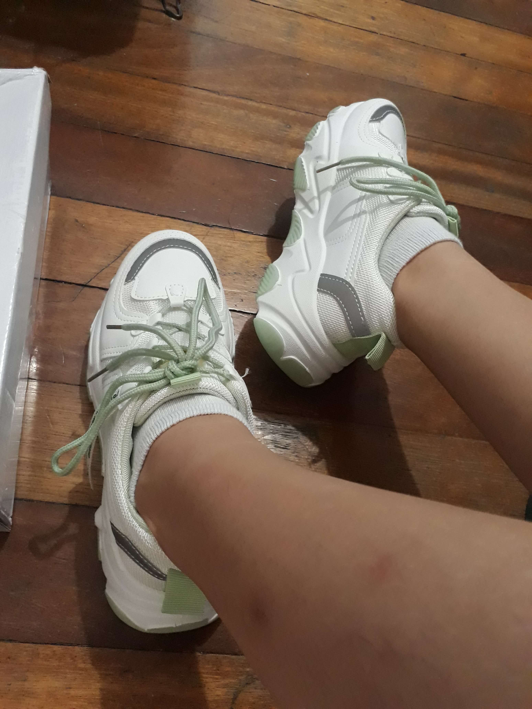
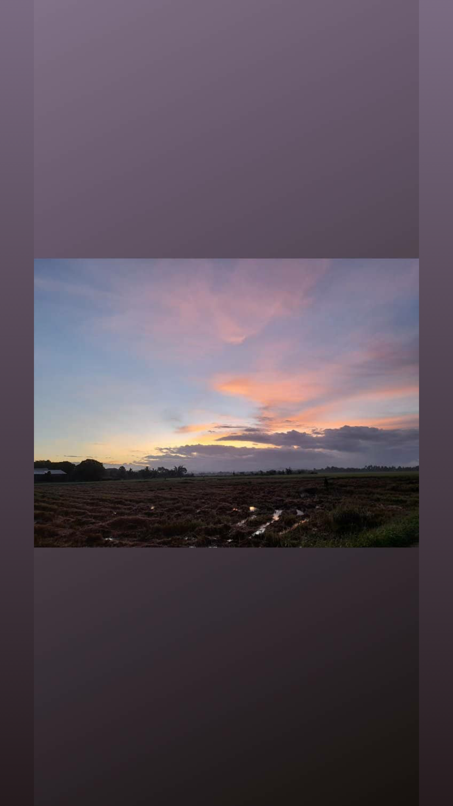

---

layout: default

title: "Last Update"

---

# May 17, 2021 Last Update

I first started this blog, well, as compliance to my course, but with a motivated and optimistic disposition as well. I was mostly focused on myself - my physical health and my mind. But throughout the course, I realized my health affects other people, too, especially my family. Whatever happens to me concerns them. And in the midst of today's turbulent climate, it may physically affect them, too.

At first, I wanted to by physically healthy and in shape for vanity's sake. Now, I want to have a healthy heart and lungs that will reassure me i have a high chance of recovery from whatever illness that may hit me. I want to have a healthy heart and lungs that will make me run for longer period of time and for longer miles. I want to have a strong and sturdy arms and shoulders that will help me carry big weights with little problem.

I want arms and shoulders that will make me independent, and no need to ask for a man's help. I do not have any problems with men offering help and being a gentleman. I only want to be independently capable just because. My capable strength, though still weak in measurement, has become one of the few things I'm proud of about myself - my average but working immune system, the practical skills I have learned by myself and with my hands, being useful and helpful to others. I want to be able to carry heavy weights by myself for my own satisfaction.

Becoming prettier and shapely through fitness training would be nice, but I want to gain and keep the inner strength that I will get from exercising.

## Did you know?

I had my birthday recently, and as a present for myself (using the birthday money gifts given to me), I bought a proper, sturdy rubber shoes. The fit is nice, the material is nice, and wearing it for the first time, I was excited in breaking it by running laps around the UPD oval (if only I can at the moment). It gave me motivation to start running again as a hobby.

{:width="300px"}

Jogging, running, sprinting. Running is so fun, I miss it so much. The wind in my face and hair, and paired with a good music, it almost feels like I could fly.

Recently, I learned that my youngest sister, who's closest to me and living in our hometown in Mindanao, has been jogging almost everyday together with her church friends at 4 in the morning.

{:width="300px"}

I didn't pay it any mind at first, but as I see her posts on *My Day*, I realized I was jealous. I miss running freely, I miss my sister, and I envy the slightly better freedom she has back in our hometown. I think it has given me another motivation in creating an alternate route so I can walk and run around my neighborhood.

It will be lonely doing it alone, but I am itching to use my new shoes and to feel my heart beat hard and strong inside my chest. I miss that sensation, too. Walking the measely  2 km (sometimes jogging it) is just not enough to produce the same adrenaline rush. It does give me enough energy that makes me water the plants outside, prune, clean, cook, and everything else with a happier and upbeat mood compared to when I'm not doing anything, but I miss feeling sweaty and dirty because of a more purposeful physical exertion. I also saw in an article that aside from the happy hormones that the body produces from exercising, and improved sleeping habits, high-impact exercises [*have been shown to promote a higher bone density than non-impact sports*][1]. And running is considered as a high-impact exercise.

So, as shameful it is to admit, I think I'll be able to start incorporating running into my lifestyle soon because of my vanity about my shoes and envy towards my sister. I hope I wasn't so shallow and simpleminded, but my sister's vitality and determination in bettering herself is very contagious. Her youthful, positive energy drives me into doing the same and trying to improve myself, too. Improve how I carry myself, how I dress, how I take care of my body; work on the things about myself to improve my mind, body and self-esteem.

It's lonely doing PE alone, and it's easy to forget to take care of your appearance living so far away from my sister for so long (almost 2 years since the pandemic started). I needed her enthusiasm to push and motivate myself.

## My next step...

In conclusion, as my next move, if the community quarantine guidelines don't improve in the next few weeks, or the cases in the Philippines do not get significantly better, especially now that there are samples of the Indian variant present in the country (though they are reported to be isolated in hospital facilities and have not spread locally yet), I will follow a route around the nearest blocks in my neighborhood, even though some of them will be commercial areas. I miss running too much, and finding out that running, which is a high-impact activity, is very beneficial gives me a lot of motivation to start running more consistently.

[1]: https://www.healthline.com/nutrition/10-benefits-of-exercise#TOC_TITLE_HDR_5

---
