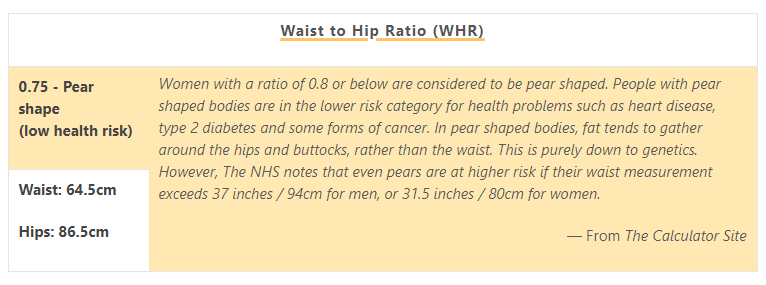
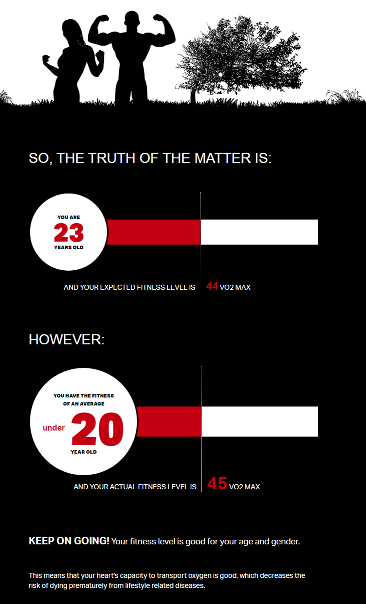
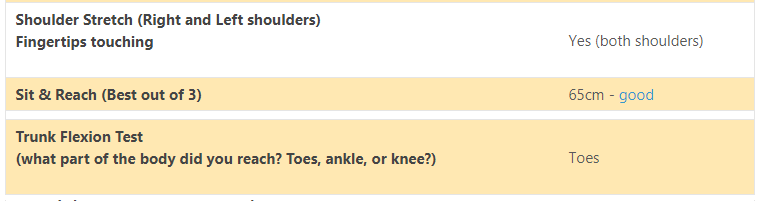
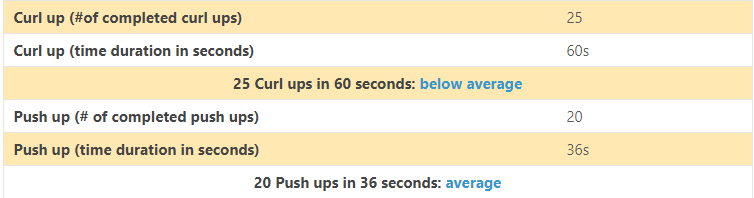
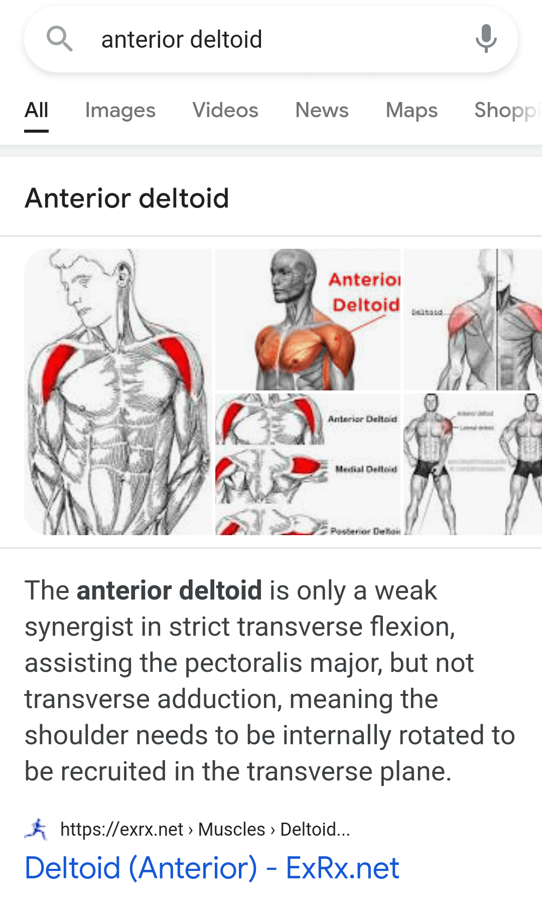
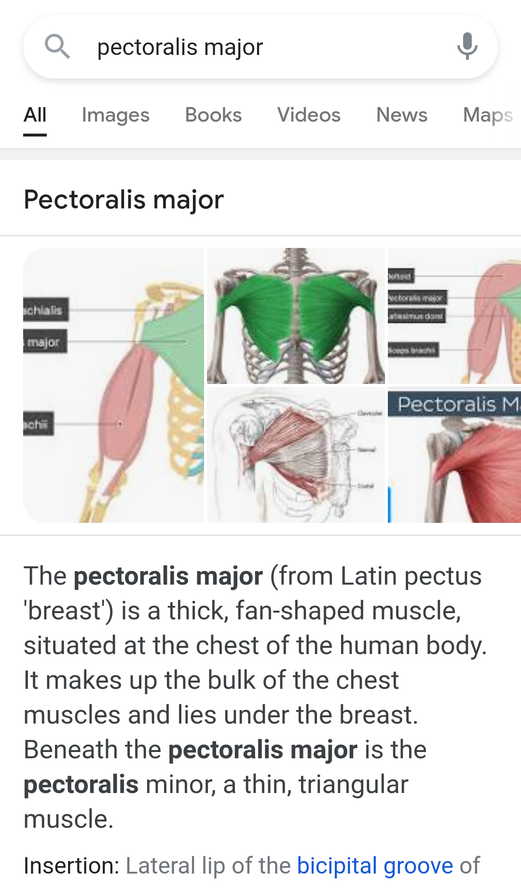
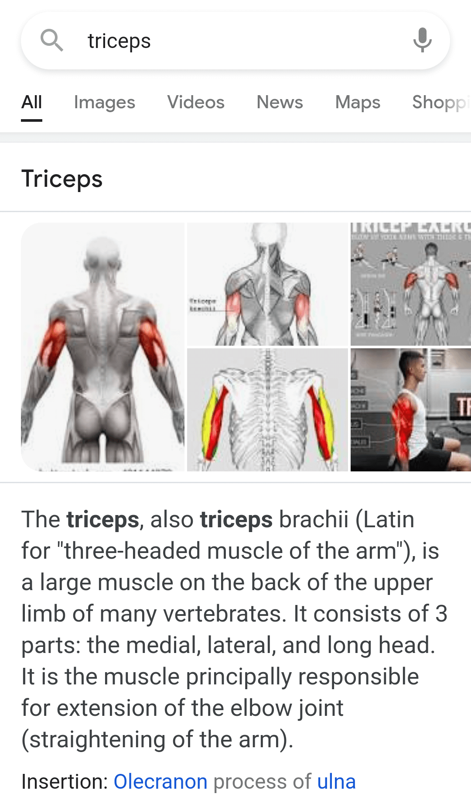

# Module 4: Assessment of Fitness Status
## _"How fit am I, really?"_

First: my BMI is 18.6 which indicates "normal weight" and my WHR is 0.75, which is classified as Pear Shape or low health risk. As for my cardiovascular health, the test on worldfitnesslevel.org says I have Good Fitness level and that my "heart's capacity to transport oxygen is good."

&nbsp; 
&nbsp; 
&nbsp; 
    
In the [pre-assessment test](about.md), we were asked to perform several exercises which will tell us our current fitness level regarding specific health components, namely, cardiovascular endurance, flexibility, muscular endurance, muscle strength, and body compositions. The main exercises were Sit & Reach, Plank Test, Curl Up, Push Up, and Trunk Flexion test.

For Sit & Reach, my best out of 3 was 65cm, which was "good" for me, as a woman. This indicates that I have "good" flexibility. My performance while doing Shoulder Stretch and Trunk Flexion Test also indicate that I have good flexibility.

&nbsp; 
    
Next: For Plank test, I managed to hold the preparatory stance for 37.53 seconds. I don't know what that says about my fitness level but I believe the plank test's purpose is to test the core muscle strength. Because I struggled while doing the test, I think this indicates that I need to work on my core muscle strength.
    
The next exercises are Curl up and Push up. The Curl Up test measures the strength and endurance of the abdominal muscles, while the Push Up test meaures the muscular strength and endurance of the upper body, which includes the shoulders, the chest, and the triceps or upper arm. I did below average to average for curl up and push up test, based on the number of repetitions I did, however, I only lasted 36 seconds for Push up and not a full minute.

&nbsp; 

{:width="300px"}
{:width="300px"}

    
Overall, I can safely conclude that this means my upper body and core muscles have poor or below average muscular strength and endurance and that I need to improve them. Therefore, the health component that I wish to understand with my body is muscular strength and endurance, particularly of my core and upper body.
	
I believe that the most possible explanation as to why my cardiovascular health and flexibility are okay while my core and upper body strength and endurance are poor is because of the kinds of physical activities I do in my current lifestyle. As I said in my introduction in the course site before, I am the person in our household who mainly run the errands and do most of the chores. I walk an average of a kilometer one to three times a week, and less now due to the reimposed ECQ. one kilometer sounds relatively little, but it's enough for my leg muscles to strengthen by walking one kilometer to my destination and another kilometer to return home. It became normal for me to walk this distance since last year, the start of the pandemic. Out of all the major muscle groups, my legs are the ones that get the most exercise.
	
If I have extra energy on that particular day, or in a hurry, I run and brisk walk, too. My shoulders get exercise by walking while carrying 3-4 kilos of weight on my way back home. I can carry roughly 3 kilos or 1 gallon with one hand, carry 5 kilos in an ecobag on my shoulder, and carry 15 to 21 kilos with both hands supporting the weight from the bottom. I can't walk too far, like more than 20 meters while carrying 15 kilos and above, however. I think, I have strength in my forearms but have weak upper arms or triceps.

<iframe src="https://www.youtube.com/embed/GxD7AyaMlPY" width="100%" title="YouTube video player" frameborder="0" allow="accelerometer; autoplay; clipboard-write; encrypted-media; gyroscope; picture-in-picture" allowfullscreen></iframe>
    
With this simple body analysis, I believe my conclusions are in harmony with the short-term and long-term goals I have made together with my [reflection essay](goals.md). Focusing on my upper body and core muscle strength and endurance will address my concern about my visceral fat, improve my performance in doing push-ups and plank test. I initially wanted to gain strength or power as one of my long-term goals, too. As for my goal of lowering my resting heart rate: even though my test result for cardiovascular fitness says my heart is in "good" condition, I think this addresses my eating habit or diet. Perhaps reducing the amount of caffeine and sugar, may help, but I am not looking forward to it. Or maybe I'm just being a hypochondriac but I can't help question my health when i feel palpitations.
    
Despite some of my positive results - with my BMI, WHR and cardiovascular fitness level - I still wish to improve my body's condition, particularly my muscle strength, muscular endurance, and body composition, and therefore, consecutively, improve my power. MHR shows that I have a small waist and my BMI shows that I can be thin, however, it does not indicate one of my insecurities about my body, which is my visible "soft" belly or my _visceral fat_. My body is what is commonly known as "skinny fat" where the extremities are thin but visceral fat is present.
    
> **Visceral fat** - located around the organs inside the belly and is deeper in the body than _subcutaneous_ fat, which lies under the skin. (Mackenzie, 1999)
> 

---

### STUDY QUESTIONS
1. **Do you need to improve your cardiovascular fitness level?**
    - Technically, I don't need to improve my cardiovascular fitness level as my Fitness Level is good for my age (23). My fitness level of 45 VO2 Max is of an average uner-20-year-old. However, I would like to "keep going." If I can't improve my heart's capacity to transport oxygen, then I at least want to maintain my heart's current capacity.
3. **Do you believe that females are more flexible than males?**
    - Honestly, yes, because women biologically have softer muscles than men. Although, it might seem the opposite because physically fit men seem to be more light on their feet than women, many men seem to be agile than women while women are more flexible than men.
4. **How many seconds did you do your push-ups and curl-ups?**
    - I couldn't complete the whole minute doing the push-ups, but I managed to do it for curl-ups. On the other hand, while I couldn't finish the whole 60 seconds for push-ups, I did manage to do 20 push-ups in 36 seconds. Based on the number of push-ups, I did _average_ for my age group, but I couldn't celebrate it because I didn't last for 60 seconds. For curl ups, I did 25 curl-ups in 60 seconds which is _below average_ so I'm not too happy about that either.
5. **Are you satisfied with your BMI and WHR results?**
    - Yes but my biggest concern is maintaining it as my BMI is near the threshold for 'underweight' category. It is very easy for me to lose weight because of stress and lack of appetite because of food that I find unappeealing/that I do not like.

---
### References
- Mackenzie, B. (1999). _The Benefits of Exercising._ \[WWW\]. Retrieved on March 19, 2021 from https://www.brainmac.co.uk/fitness.htm

